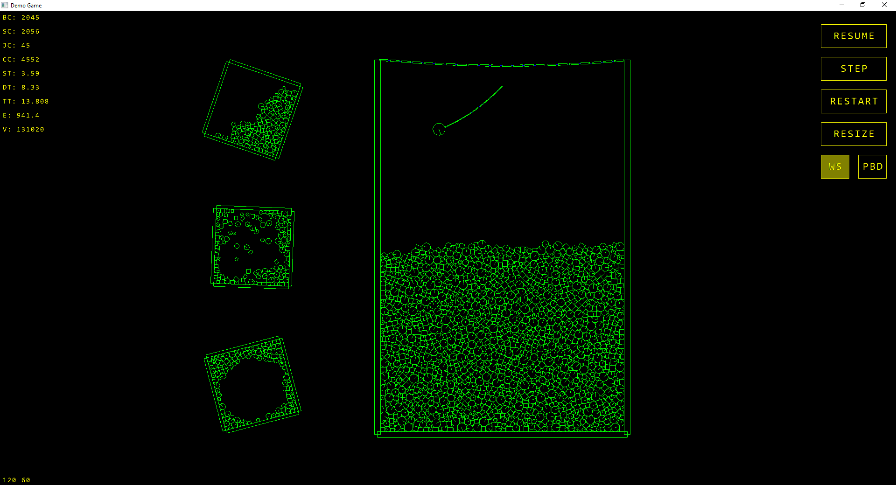

# Game Framework

A high-performance, cross-platform 2D game framework written in C99.

## Getting Started

### The Game Loop
A game typically runs in a loop until the window closes. It can poll for available events at the start of each frame, then proceed with the update and render phases, like in this simplified example:
```c
while (window_is_open()) {
    Window_Event event;
    while (window_poll_event(&event)) {
        if (event.type == WINDOW_EVENT_WINDOW_CREATED) {
            graphics_init(event.state_event.window);
            // load textures...
        }
        if (event.type == WINDOW_EVENT_WINDOW_DESTROYED) {
            graphics_uninit(event.state_event.window);
        }
        // handle events...
    }

    // Update
    input_update();
    physics_world_step(world, delta_time, true, true);

    // Render
    graphics_clear(&clear_color);
    // draw scene...
    graphics_display();
}
```

### Windows Initialization
On Windows, some additional setup is required before the game loop:
 ```c
// configure metadata
config_set_value(CONFIG_KEY_WINDOW_TITLE, "My Game");
config_set_value(CONFIG_KEY_WINDOW_CLASS, "MyGameClass");
config_set_value(CONFIG_KEY_FOLDER_NAME, "MyGameData");

// create the game window
window_create(width, height);
```

### Android Deployment
The project files in `platform/android/` have to be updated to match your game's profile:
- Change the `package` attribute in `AndroidManifest.xml`.
- Change the `app_name` value in `res/values/strings.xml`.
- Replace the provided `game.keystore` with your own keystore.
- Enter the signing credentials in `build.xml` (key.* properties).

## Project Structure
The core engine logic and platform-specific backends are separated, making the game layer platform agnostic:
- **`source/game/`**: High-level application code utilizing the engine's API.
- **`source/engine/`**: Platform-independent modules for physics, graphics, geometry, input, and memory management.
- **`platform/`**: Native implementations for Windows and Android.

## Components

### Physics
A custom 2D rigid-body physics simulator:
- **Collision Detection**
    - **Broad Phase**: Efficient **Sweep and Prune** algorithm and **AABB Test**.
    - **Narrow Phase**: **Separating Axis Theorem (SAT)** for polygons and specialized routines for circles and segments.
- **Constraint Solver**: Impulse-based velocity solver with position correction to resolve overlaps without adding extra energy to the system.
    - **Convergence Assurance Techniques**:
        - **Warm-Starting**: Applies the total impulse generated by each constraint in every frame.
        - **Position-Based Dynamics**: Converts position changes back into velocity.
- **Contact Manifolds**: Multiple contact points are generated when needed for more accurate simulation and jitter-free stacking.
- **Automatic Mass**: Physical properties (centroid, mass, inertia) are automatically calculated based on collider geometry and density.
- **Filtering**: Mask and group-based collision filtering with sensor support (callbacks without physical resolution).
- **Memory Pools**: Cache-friendly allocation of the physics objects.

### Graphics
A simple 2D rendering API for maximum compatibility:
- **Primitives**: High-level draw functions for segments, circles, polygons, and rectangles.
- **Transform Stack**: Full support for hierarchical transformations (translation, rotation, scaling).
- **State Stack**: Push/pop graphics states, including colors, textures, and line properties.
- **Typography**: Sprite-font system with alignment and formatted string support.

### Audio System
Multi-platform audio engine for consistent sound effects:
- **Asynchronous Nature**: All sounds are played in the background without pausing the application.
- **Concurrent Playback Support**: Multiple audio streams can be played simultaneously.
- **Sound Control**: Granular volume control, pause/resume, and seeking functionalities are available.

### Window System
A unified event-driven windowing system that abstracts away platform-specific lifecycles:
- **Event Loop Support**: Use `window_poll_event` to handle a variety of events, including touch/mouse input, key presses, and window state changes.
- **Unified Input**: Mouse clicks are mapped to `WINDOW_EVENT_TOUCH_*` events, providing a consistent interface for both desktop and mobile platforms.

## Platform Implementations
### Windows
- Rendering API: Desktop **OpenGL** using fixed-function pipeline.
- Audio Playback: Implemented via **DirectShow** (Graph Builder), supporting a wide range of audio formats.
- Windowing System: Standard Win32 `WNDCLASS` configuration and `WndProc`-based event processing.
- Asset Management: Embedded resources are extracted into a local temporary folder to be accessible via standard file I/O.

### Android
- Rendering API: **OpenGL ES 1.1** utilizing vertex arrays.
- Audio Playback: Integrated with **OpenSL ES** for optimized mobile performance.
- Windowing System: Asynchronous `NativeActivity` implementation that forwards lifecycle and input events to the game.
- Asset Management: Asset files are read directly from the APK using `AAssetManager`.

## Technical Philosophy
- **Zero Dependencies**: No third-party libraries are used, only platform-native APIs and standard C99.
- **Encapsulation**: Platform-specific headers (like `windows.h` or `GLES/egl.h`) are hidden within the platform layer to ensure fast compilation of game code.

## Demo Screenshots


